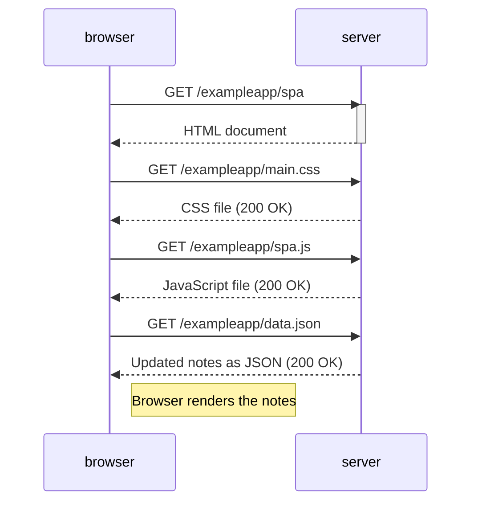

# 0.5: spa diagram

```mermaid
sequenceDiagram
    participant browser
    participant server

    browser->>server: GET /exampleapp/spa

    activate server
    server-->>browser: HTML document
    deactivate server

    browser->>server: GET /exampleapp/main.css
    server-->>browser: CSS file (200 OK)

    browser->>server: GET /exampleapp/spa.js
    server-->>browser: JavaScript file (200 OK)

    browser->>server: GET /exampleapp/data.json
    server-->>browser: Updated notes as JSON (200 OK)

    Note right of browser: Browser renders the notes


```
